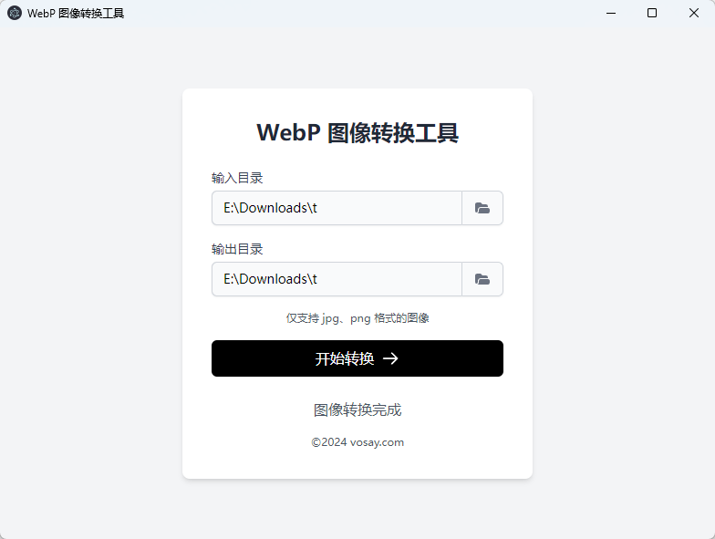

# WebP 图像转换工具



这是一个使用 Electron 构建的桌面应用程序，用于批量将 JPG 和 PNG 格式的图像转换为 WebP 格式。

## 功能

- 批量转换 JPG 和 PNG 图像为 WebP 格式
- 支持选择输入和输出目录
- 实时显示转换进度
- 跨平台支持（Windows、macOS、Linux）

## 安装

1. 克隆此仓库
2. 运行 `npm i` 安装依赖
3. 运行 `npm run start` 启动应用程序

## 构建

要构建可分发的应用程序，请运行：

```bash
npm run build
```

这将为您的操作系统创建一个可执行文件。

## 使用方法

1. 启动应用程序
2. 选择包含 JPG 和/或 PNG 图像的输入目录
3. （可选）选择输出目录。如果不选择，转换后的图像将保存在输入目录中
4. 点击"转换"按钮开始转换过程
5. 等待转换完成

## 技术栈

- Electron
- Sharp（用于图像处理）
- TailwindCSS（用于样式）

## 许可证

本项目采用 MIT 许可证。详情请见 [LICENSE](LICENSE) 文件。
